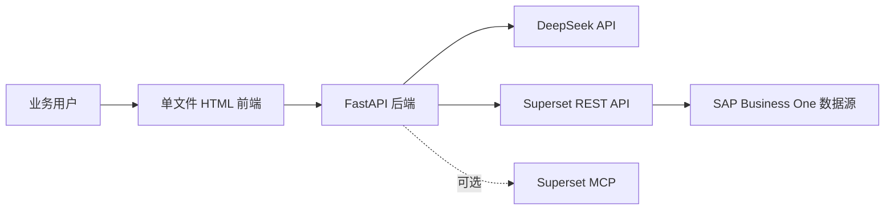
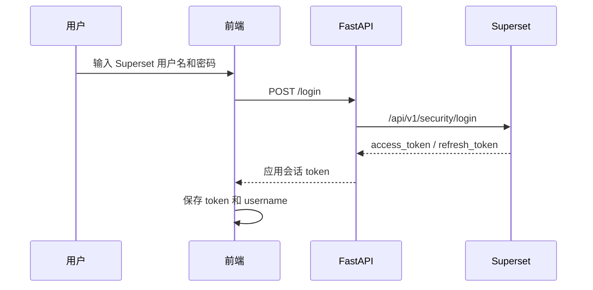
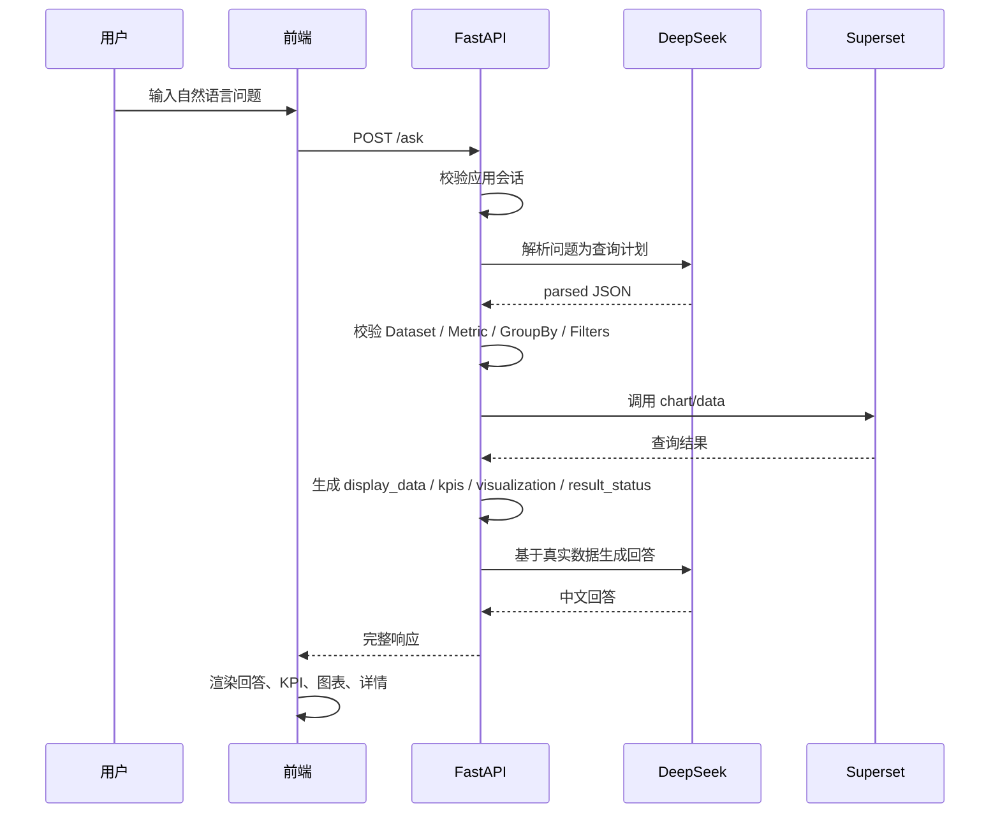

# AI Business Insight 业务与技术规格说明

## 1. 文档目的

本文档用于描述 `ai-superset-demo` 的业务需求、产品边界、系统架构与后续演进方向。它面向业务负责人、系统管理员、开发人员和后续维护人员，目标是在继续开发前先形成一份共同理解：

- 这个系统要解决什么业务问题。
- 当前 Demo 已经具备哪些能力。
- 哪些能力应由 AI 完成，哪些能力应由 Superset、后端服务或前端完成。
- 权限、RLS、数据安全和错误兜底应如何设计。
- 后续产品化应该按什么阶段演进。

本文档描述的是当前 Demo 到产品化雏形之间的初始规格，不等同于最终生产系统设计。

## 2. 项目背景

企业当前经营数据来自 SAP Business One，并通过 Superset 建模为可查询的数据集。管理层和业务人员希望用自然语言直接询问经营问题，例如销售额、区域排行、客户排行、产品趋势等，而不是手工进入报表、筛选条件或编写 SQL。

传统 BI 使用方式存在几个痛点：

- 业务人员需要知道报表入口、筛选字段和指标含义。
- 管理层临时追问时，通常需要数据人员二次取数。
- 多区域、多角色查看数据时，需要保证权限和 RLS 生效。
- 查询失败、空结果、字段不匹配等问题对业务用户不可理解。

`ai-superset-demo` 的目标是验证一种企业 AI BI 问答模式：AI 负责理解问题和生成解释，Superset 负责语义层、权限控制和数据查询，前端负责以聊天、KPI、表格和图表的方式展示结果。

## 3. 业务目标

系统的核心业务目标如下：

- 让管理层可以用自然语言查询经营指标。
- 让区域经理只能看到其 Superset 权限和 RLS 允许的数据。
- 降低业务用户理解 Dataset、Metric、GroupBy、Filter 和 Time Range 的门槛。
- 对趋势、排行、结构和单指标查询自动生成适合阅读的回答。
- 对查询失败、空结果、指标为空等情况给出可理解的解释，而不是直接暴露技术错误。
- 保留技术详情，方便开发人员、数据管理员和实施人员排查问题。

## 4. 用户角色

### 4.1 管理层用户

管理层用户关注整体经营情况，例如销售额趋势、区域贡献、客户排行和产品结构。此类用户更关注结论、关键数字和图表，不应被 SQL、Dataset 字段或接口错误打断。

### 4.2 区域经理

区域经理使用自己的 Superset 账号登录系统。系统每次查询都应使用当前登录用户的 Superset Token，让 Superset 的权限、角色和 RLS 策略自然生效。

### 4.3 系统管理员

系统管理员负责维护 Superset Dataset、Metric、Column、RLS、用户角色、数据源连接和后端环境变量。管理员也需要通过技术详情查看 AI 解析结果、Superset SQL 和原始返回。

### 4.4 开发与实施人员

开发与实施人员负责扩展业务域、调整提示词、维护接口契约、增加测试、排查 Superset API 或 MCP 集成问题。

## 5. 核心业务场景

### 5.1 单指标查询

用户问题示例：

- 本月华东销售额是多少？
- 今年销售额是多少？
- 本月订单数是多少？

系统应返回：

- 简洁自然语言回答。
- KPI 卡片。
- 查询条件摘要。
- Token 用量。
- 可展开的技术详情。

### 5.2 趋势分析

用户问题示例：

- 近 6 个月销售额趋势。
- 按年列出每年的销售额，并分析一下。
- 我想看看每个月的销售额。

系统应返回：

- 趋势概括。
- 按时间排序的数据。
- 折线图。
- 明细表格。

时间类问题需要正确处理 `time_range`、`time_grain` 和 Superset 时间字段。当前约定优先使用 Superset Dataset 中的时间字段，并在必要时把 `This month`、`Last 6 months` 等表达转换为明确日期范围。

### 5.3 排行与对比分析

用户问题示例：

- 本月销售额按区域排行。
- 看客户排行。
- 看产品组排行。

系统应返回：

- 排行概括。
- 柱状图。
- 明细表格。
- 相关建议追问。

### 5.4 上下文追问

用户问题示例：

- 为什么都是 0？
- 这个趋势为什么是上升的？
- 刚才这个结果是不是不对？

当用户是在追问上一轮结果，而不是提出新的取数需求时，系统应优先基于上一轮上下文回答，不应强行构造新的 Dataset 查询。若上一轮数据不足以回答，应提示需要补充或重新查询的内容。

### 5.5 查询失败后的自修复与诊断

当 Superset 返回可修复错误时，例如字段不存在、时间粒度冲突、图表参数不符合要求，系统应尝试让 AI 基于 Dataset 元数据和错误信息修复查询计划，并重新调用 Superset。

当多次修复仍失败时，系统应返回面向用户的诊断说明，不应编造业务数据。

## 6. 功能范围

### 6.1 当前 Demo 范围

当前 Demo 包含：

- Web 登录。
- 基于当前用户的 Superset Token 查询。
- 自然语言问题解析。
- Superset REST API 查询。
- MCP 查询能力预留。
- 查询计划校验。
- 查询失败自动修复。
- 空结果和无效指标兜底。
- AI 生成中文回答。
- KPI、表格、折线图、柱状图展示。
- Token 用量展示。
- 技术详情展开，包括 parsed JSON、Superset SQL、原始返回 JSON。
- 建议追问按钮。

### 6.2 暂不纳入当前 Demo 的范围

以下能力暂不作为当前 Demo 的硬性目标：

- 完整生产级用户管理。
- 长期持久化会话。
- 完整审计日志。
- 多租户隔离。
- 复杂权限配置界面。
- 多业务域配置化管理后台。
- AI 模型供应商切换管理。
- 离线任务、订阅推送和预警。

## 7. 系统架构

系统由四个主要部分组成：



### 7.1 前端

前端是单文件 `index.html`，使用 HTML、TailwindCSS CDN、原生 JavaScript 和 ECharts CDN。它负责：

- 登录界面。
- 聊天式问答交互。
- 输入框快捷键处理。
- Loading 动画。
- AI 消息渲染。
- KPI、表格和图表展示。
- 技术详情折叠展示。
- Token 用量展示。
- 建议追问按钮。

前端不负责权限判断和数据安全，只负责展示后端返回结果。

### 7.2 后端

后端使用 FastAPI，入口为 `main.py`。它负责：

- 暴露 HTTP 接口。
- 校验登录态。
- 管理应用会话。
- 调用 DeepSeek。
- 调用 Superset REST API。
- 调用或预留 MCP Agent。
- 执行查询计划校验、修复、兜底和格式化。

### 7.3 AI 模型

当前使用 DeepSeek API。AI 主要承担三类任务：

- 把自然语言问题解析为结构化查询计划。
- 查询失败时修复查询计划。
- 基于真实查询结果生成中文经营分析回答。

AI 不应绕过 Superset 权限，不应直接访问数据库，不应编造不存在的数据。

### 7.4 Superset

Superset 是语义层和权限执行层，负责：

- Dataset 元数据。
- Metric 定义。
- Column、GroupBy、Filter 能力。
- SQL 生成。
- RLS 和 RBAC 权限控制。
- 查询 SAP Business One 数据。

后端应尽量通过 Superset REST API 查询数据，而不是直接连接业务数据库。

### 7.5 MCP

系统预留 Superset MCP 能力。当前默认查询方式仍建议使用 REST API，因为 REST API 更稳定、可控、易调试。MCP 适合作为后续 Agent 化能力扩展，例如让 AI 自主发现 Dataset、诊断 Superset 环境、调用更多工具。

## 8. 核心数据流

### 8.1 登录流程



登录后，后端在内存中保存当前应用会话与 Superset Token 的关联。每次 `/ask` 请求必须携带应用会话 Token。

### 8.2 问答流程



### 8.3 自动修复流程

当 Superset 查询失败且错误可修复时：

1. 后端记录当前查询计划和错误信息。
2. AI 基于用户问题、当前计划、错误信息、历史修复记录和 Dataset 元数据生成新的查询计划。
3. 后端重新校验并调用 Superset。
4. 最多重试配置的次数。
5. 若仍失败，则生成用户可理解的诊断回答。

## 9. 模块职责

### 9.1 `main.py`

FastAPI 入口，负责接口路由、CORS、首页文件返回、登录、数据集加载、MCP 状态和问答入口。

### 9.2 `auth.py`

负责登录校验和应用会话管理：

- 调用 Superset 登录接口。
- 生成应用会话 Token。
- 校验请求 Authorization。
- 从内存会话中取出当前 Superset Token。

当前会话保存在内存中，服务重启后会失效。

### 9.3 `planner_ai.py`

负责自然语言到查询计划的 AI 解析，以及查询计划合法性校验。它根据 Superset Dataset 元数据约束 AI 只能选择真实存在的 Dataset、Metric、GroupBy 和 Filter 字段。

### 9.4 `superset_client.py`

封装 Superset REST API：

- 登录。
- 获取 CSRF Token。
- 查询 Dataset。
- 读取 Dataset 元数据。
- 构造 `/api/v1/chart/data` 请求。
- 统一处理 Superset 错误。

### 9.5 `executor.py`

负责执行查询计划：

- 校验解析结果。
- 调用 Superset。
- 提取数据。
- 排序时间序列。
- 生成展示数据、KPI、图表描述和结果状态。
- 在失败时触发自动修复。

### 9.6 `guardrail.py`

负责查询结果兜底：

- Superset 未返回结果。
- Superset 查询错误。
- 空数据。
- 指标列缺失。
- 指标值全为空。

Guardrail 的原则是：不能回答就明确说明原因，不让 AI 编造结果。

### 9.7 `answer.py`

负责生成展示数据、KPI 和 AI 回答。AI 回答必须基于真实查询结果，不应重复用户问题，不应解释 SQL 或技术实现。

### 9.8 `visualization.py`

负责根据 `parsed`、`display_data`、`kpis` 和 `result_status` 自动生成图表描述：

- `kpi`：单指标。
- `line`：时间趋势。
- `bar`：分类对比或排行。

前端根据该描述使用 ECharts 渲染图表。

### 9.9 `context.py`

负责上下文追问判断和回答。若用户问题更像对上一轮结果的质疑、解释或追问，应基于上一轮上下文回答，而不是直接构造新的 Dataset 查询。

### 9.10 `mcp_client.py` 与 `mcp_agent.py`

负责 Superset MCP 集成。当前保留 MCP 能力，但默认建议使用 REST API 查询主链路。

## 10. 接口契约

### 10.1 `POST /login`

请求：

```json
{
  "username": "east",
  "password": "1111"
}
```

响应：

```json
{
  "username": "east",
  "token": "<app session token>"
}
```

### 10.2 `POST /ask`

请求 Header：

```http
Authorization: Bearer <app session token>
Content-Type: application/json
```

请求 Body：

```json
{
  "question": "销售额按区域排行",
  "context": {
    "question": "上一轮问题",
    "parsed": {},
    "answer": "上一轮回答",
    "kpis": [],
    "display_data": [],
    "data": []
  }
}
```

响应核心结构：

```json
{
  "question": "销售额按区域排行",
  "parsed": {
    "dataset": "sales_order_analysis",
    "metric": "sales_amount",
    "groupby": ["Region"],
    "time_grain": null,
    "time_range": "No filter",
    "filters": []
  },
  "answer": "销售额按区域排行数据显示...",
  "data": [],
  "display_data": [],
  "kpis": [],
  "visualization": {
    "type": "bar",
    "title": "销售金额对比",
    "x": "Region",
    "y": "销售金额",
    "points": [
      {
        "name": "华东",
        "value": 97869361.81
      }
    ]
  },
  "token_usage": {
    "parse": {},
    "answer": {},
    "total": {},
    "answer_mode": "ai"
  },
  "result_status": {
    "can_answer": true,
    "reason": "ok",
    "message": "查询成功。"
  },
  "repair_history": [],
  "superset_result": {}
}
```

### 10.3 `GET /datasets/load`

用于按当前登录用户加载可访问 Dataset 元数据。该接口主要用于调试和初始化验证。

### 10.4 `GET /mcp/status`

用于检查 MCP 配置和可用工具状态。当前不作为主问答链路必需接口。

## 11. 权限与安全设计

### 11.1 动态用户

用户在前端输入 Superset 用户名和密码登录。后端不使用固定全局用户执行业务查询，而是在每次请求中使用当前用户对应的 Superset Token。

### 11.2 RLS 与 RBAC

RLS 和 RBAC 应由 Superset 统一执行。后端不应直接拼接 SQL 绕过 Superset，也不应直接访问业务数据库来规避 Superset 权限。

### 11.3 Dataset Allowlist

当前系统仍保留 Dataset allowlist，只允许 AI 在指定业务 Dataset 中选择。这是 Demo 阶段的安全边界，避免 AI 误选无关 Dataset。

后续可以演进为配置化管理，而不是写死在代码中。

### 11.4 Token 与会话

当前应用会话保存在内存中，适合 Demo。生产环境应改为 Redis、数据库或受控 Session 存储，并加入过期刷新、登出失效和审计日志。

### 11.5 MCP 权限隔离

MCP 后续若作为主链路，需要保证：

- MCP 请求携带当前业务用户身份。
- MCP 能识别 JWT 中的用户 claim。
- MCP 工具调用不绕过 Superset 权限。
- MCP 调用日志可审计。

## 12. 错误处理与兜底策略

### 12.1 登录过期

当 Superset 返回 token 过期或 401 时，后端返回登录过期提示，前端应引导用户重新登录。

### 12.2 解析失败

当 AI 无法解析出合法 Dataset 或 Metric 时，系统应判断是否为上下文追问。若不是追问，应提示用户补充指标、时间范围或维度。

### 12.3 查询失败

当 Superset 查询失败时，系统先判断是否可修复。可修复则进入自动修复流程；不可修复则返回用户可理解的错误说明。

### 12.4 空结果

当查询成功但没有数据时，系统应说明未查询到符合条件的数据，并展示已使用的时间范围和过滤条件。

### 12.5 指标为空

当返回数据存在但指标值为空时，系统应说明结果中没有有效指标数值，不能让 AI 生成看似确定的业务结论。

### 12.6 编码问题

当 Superset 返回文本字段出现常见编码串味时，展示层可以进行纠偏，例如将 GBK 文本被 Latin-1 解码后的乱码恢复为中文。原始 Superset 返回仍应保留在技术详情中，便于排查数据源编码问题。

## 13. 图表展示规则

系统应根据查询结果自动选择展示方式：

- 单指标、单行数据：KPI 卡片。
- 时间趋势：折线图。
- 分类排行或对比：柱状图。
- 明细数据：表格。
- 无有效数据：不展示空图表。

后端返回 `visualization` 描述，前端负责渲染。这样可以保持业务逻辑和展示实现解耦。

## 14. 当前限制

当前系统仍有以下限制：

- Dataset allowlist 仍在代码中维护。
- 会话存储在内存中，服务重启后需要重新登录。
- AI 解析依赖提示词和 Superset 元数据，复杂业务语义仍可能解析不准。
- 自动修复次数有限，不能保证所有 Superset 错误都可恢复。
- 图表类型推断仍是基础规则，尚未支持多指标、多系列、堆叠图、饼图等。
- Token 用量只统计 AI 调用，不包含 Superset 查询成本。
- 缺少生产级审计日志、监控和告警。
- MCP 能力已经预留，但尚不建议作为默认查询主链路。

## 15. 后续演进路线

### 阶段一：稳定 REST API 问答主链路

目标是让自然语言到 Superset REST API 查询的链路稳定可控。重点包括：

- 完善 Dataset 元数据加载。
- 提升时间范围和时间粒度处理。
- 稳定当前用户 Token 使用。
- 完善 Guardrail 和错误提示。
- 增加核心场景测试。

### 阶段二：增强自动修复和诊断

目标是让用户遇到 Superset 错误时，系统可以自动诊断、修复并重试。重点包括：

- 扩展可修复错误类型。
- 记录 repair history。
- 将技术错误转化为业务可理解说明。
- 避免 AI 为了查询成功而删除用户明确条件。

### 阶段三：配置化业务语义层

目标是减少代码中的硬编码。重点包括：

- Dataset allowlist 配置化。
- Metric 中文含义配置化。
- 常用同义词配置化。
- 业务问题模板和建议追问配置化。

### 阶段四：MCP Agent 能力验证

目标是验证 AI 是否可以通过 MCP 更自主地发现 Dataset、调用 Superset 工具和诊断问题。重点包括：

- 动态用户 JWT。
- MCP 权限隔离。
- MCP 工具调用审计。
- 限制工具调用次数和成本。

### 阶段五：产品化与生产治理

目标是从 Demo 走向企业内部产品。重点包括：

- 持久化会话。
- 审计日志。
- 用户行为记录。
- 权限配置界面。
- 监控和告警。
- 多业务域扩展。
- 数据质量提示。

## 16. 验收标准

初始 Demo 可按以下标准验收：

- 用户可以使用 Superset 账号登录。
- east / west 等不同用户查询时，使用各自 Superset Token。
- RLS 由 Superset 生效，后端不绕过权限。
- 常见问题可以解析为合法查询计划。
- 查询结果可以生成自然语言回答。
- 单指标、趋势、排行场景可以展示 KPI 或图表。
- 空结果和指标为空时不会编造答案。
- Superset 可修复错误会触发自动修复。
- 页面保留技术详情用于排查。
- Token 用量可见。

## 17. 关键设计原则

- AI 负责理解和表达，不负责绕过权限取数。
- Superset 是数据权限和语义层的可信边界。
- 后端负责校验、兜底和可控编排。
- 前端负责清晰展示，不做安全判断。
- 查询失败时优先自动修复，不能修复时给出可理解诊断。
- 没有数据就明确说明没有数据，不生成虚假经营结论。
