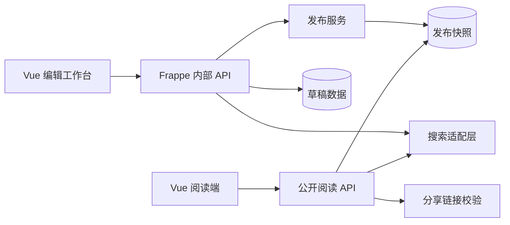
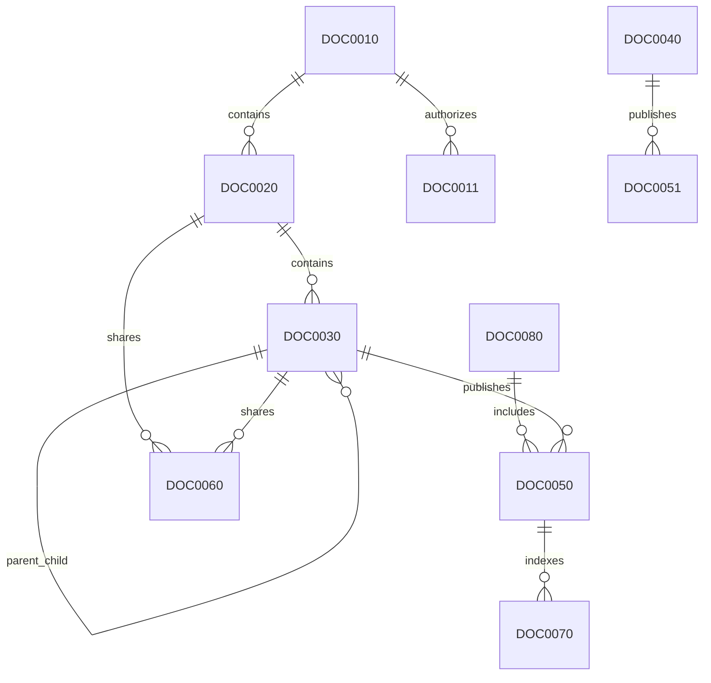
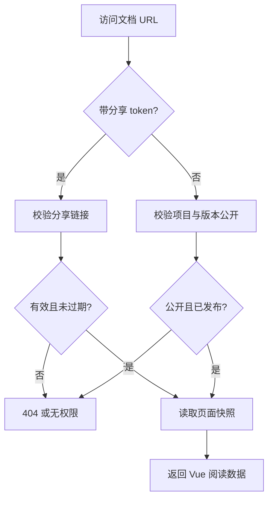

# 企业级文档平台设计说明

## 1. 背景与目标

本项目建设一个基于 Frappe Framework 的企业级文档平台，用于统一管理公司多个外部接口项目的文档体系，包括 API 文档、用户操作手册、SDK 文档、Webhook 文档、FAQ、错误码说明、系统架构说明和更新日志。

平台以独立 Frappe 应用交付，应用名为 `docs`，中文名为“文档”。它面向两类用户：

- 内部用户：在登录后通过文档工作台创建、编辑、预览、发布和回滚文档。
- 外部用户：匿名访问公开文档，或通过私密分享链接访问指定页面或指定版本空间。

产品体验目标是阅读端接近 Stripe Docs、Supabase Docs、Cloudflare Docs 等现代开发者文档平台；编辑端接近 Notion-lite，但第一阶段聚焦树状目录、Markdown 编辑、实时预览、图表编辑和发布治理，不实现完整块编辑器或多人协同。

## 2. 范围

### 2.1 MVP 范围

MVP 直接包含以下能力：

- 独立 `docs` Frappe 应用。
- 多文档项目空间。
- 项目下多个文档版本空间，例如 `/v1`、`/v2`。
- 版本创建支持空白创建和从已有版本复制。
- 树状文档目录，支持父子层级、排序、slug 和路径。
- Markdown 作为权威存储格式。
- Milkdown 作为 Markdown-first 编辑器，提供类富文本编辑体验。
- Mermaid 图表渲染。
- draw.io 图表块集成，保存源 XML 与渲染结果。
- 页面发布快照、图表发布快照和发布记录。
- 单页发布、整版本发布和历史回滚。
- 匿名公开访问已发布内容。
- 页面级和版本空间级私密分享链接。
- 项目级内部权限。
- 基础数据库搜索，并预留 Meilisearch / Typesense 搜索适配。
- Vue SPA 编辑端与阅读端，并复用文档树和渲染组件。

### 2.2 非 MVP 范围

以下能力作为后续扩展，不进入第一阶段实现：

- OpenAPI / Swagger 自动导入与同步。
- AI 搜索、问答和摘要。
- 客户门户与客户级权限矩阵。
- 页面级内部权限。
- 审批流。
- 多人实时协同编辑。
- 评论、批注和任务流转。
- 复杂访问分析、热力图和内容质量评分。
- Git 双向同步。

## 3. 总体架构

`docs` app 采用“Frappe 平台内核 + Vue SPA 前端”的架构。

Frappe 负责：

- DocType 数据模型。
- 权限与访问控制。
- 草稿、发布快照和发布记录。
- 文件与附件管理。
- 白名单 API。
- 匿名公开访问校验。
- 私密分享链接校验。
- 搜索适配层。
- 审计字段与生命周期兜底校验。

Vue 负责：

- 内部编辑工作台。
- 外部阅读端。
- 项目切换、版本切换和文档树。
- Markdown 编辑、预览和渲染。
- Mermaid 与 draw.io 渲染。
- 搜索交互。
- 阅读端路由、锚点和代码块体验。

前端建议拆分为两个入口，但共享核心组件：

| 入口 | 访问对象 | 说明 |
| --- | --- | --- |
| `/docs-admin` | 内部用户 | 登录后使用的文档编辑工作台 |
| `/docs/{project}/{version}/{path}` | 外部用户 | 公开或分享访问的文档阅读端 |

共享组件包括：

- `DocTree`：文档树。
- `DocRenderer`：Markdown 和图表渲染。
- `VersionSwitcher`：版本切换器。
- `ProjectSwitcher`：项目切换器。
- `SearchBox`：搜索入口。
- `DiagramRenderer`：图表渲染器。
- `MarkdownEditor`：Milkdown 编辑器封装。

核心数据流如下：



## 4. 模块划分

后端按职责拆分为以下模块：

| 模块 | 职责 |
| --- | --- |
| `project` | 文档项目、项目成员、公开配置 |
| `version` | 文档版本空间、版本复制 |
| `page` | 文档页面、树结构、slug、路径、草稿内容 |
| `diagram` | Mermaid / draw.io 图表块和渲染产物 |
| `release` | 发布记录、页面快照、图表快照、回滚 |
| `share` | 私密分享链接、token、过期和启停 |
| `search` | 搜索接口、数据库搜索适配器、外部搜索扩展点 |
| `api` | 内部编辑 API 与公开阅读 API |

前端按职责拆分为以下模块：

| 模块 | 职责 |
| --- | --- |
| `admin` | 编辑工作台入口、项目管理、版本管理、发布操作 |
| `reader` | 外部阅读端入口、公开访问、分享访问 |
| `tree` | 可复用文档树、拖拽排序、选中态 |
| `editor` | Milkdown 编辑器、图片上传、图表插入 |
| `renderer` | Markdown、Mermaid、draw.io、代码高亮渲染 |
| `search` | 搜索框、搜索结果、搜索范围控制 |
| `api-client` | Frappe API 调用封装、错误处理 |

## 5. 数据模型

DocType 按现有应用风格使用 `DOC + 四位流水号` 命名。中文名称表达业务含义，技术名使用编码。

### 5.1 DocType 清单

| 编码 | 中文名称 | 类型 | 用途 |
| --- | --- | --- | --- |
| `DOC0010` | 文档项目 | 主表 | 项目空间 |
| `DOC0011` | 文档项目成员 | 子表或明细表 | 项目级内部权限 |
| `DOC0020` | 文档版本 | 主表 | `/v1`、`/v2` 版本空间 |
| `DOC0030` | 文档页面 | 主表 | 草稿态树状页面 |
| `DOC0040` | 图表块 | 主表 | Mermaid / draw.io 源内容 |
| `DOC0050` | 文档页面快照 | 主表 | 发布后的不可变页面快照 |
| `DOC0051` | 图表块快照 | 主表 | 发布后的不可变图表快照 |
| `DOC0060` | 文档分享链接 | 主表 | 私密分享 token |
| `DOC0070` | 文档搜索索引 | 主表 | 默认数据库搜索索引 |
| `DOC0080` | 文档发布记录 | 主表 | 一次发布批次和审计记录 |

### 5.2 DOC0010 文档项目

表示一个独立文档项目空间。

关键字段：

| 字段 | 类型 | 说明 |
| --- | --- | --- |
| `title` | Data | 项目标题 |
| `slug` | Data | URL 标识，全局唯一，例如 `payment` |
| `description` | Small Text | 项目说明 |
| `is_public` | Check | 是否允许匿名公开访问 |
| `default_version` | Link / Data | 默认版本 |
| `status` | Select | `active`、`archived` |

### 5.3 DOC0011 文档项目成员

表示项目级内部权限。

关键字段：

| 字段 | 类型 | 说明 |
| --- | --- | --- |
| `project` | Link | 所属文档项目 |
| `user` | Link | Frappe 用户 |
| `role` | Select | `viewer`、`editor`、`publisher`、`manager` |

MVP 不做页面级内部权限，统一按项目授权。

### 5.4 DOC0020 文档版本

表示项目下的文档版本空间。

关键字段：

| 字段 | 类型 | 说明 |
| --- | --- | --- |
| `project` | Link | 所属文档项目 |
| `version_key` | Data | 版本标识，同项目内唯一，例如 `v1`、`v2` |
| `title` | Data | 版本标题 |
| `is_default` | Check | 是否默认版本 |
| `status` | Select | `draft`、`published`、`archived` |
| `source_version` | Link | 复制创建时的来源版本 |
| `creation_mode` | Select | `blank`、`copy` |

版本创建支持两种方式：

- 空白创建：创建空文档树。
- 从已有版本复制：复制来源版本的文档树、页面草稿内容和图表引用。

### 5.5 DOC0030 文档页面

表示草稿态文档页面。

关键字段：

| 字段 | 类型 | 说明 |
| --- | --- | --- |
| `project` | Link | 所属文档项目 |
| `doc_version` | Link | 所属文档版本 |
| `parent_page` | Link | 父页面 |
| `title` | Data | 页面标题 |
| `slug` | Data | 当前层级 URL 片段 |
| `path` | Data | 由父级 slug 组合生成，同版本内唯一 |
| `doc_type` | Select | `api`、`manual`、`sdk`、`webhook`、`faq`、`error_code`、`architecture`、`changelog`、`other` |
| `content_markdown` | Long Text | Markdown 草稿内容 |
| `summary` | Small Text | 摘要 |
| `sort_order` | Int | 同级排序 |
| `status` | Select | `draft`、`published`、`archived` |
| `review_status` | Select | `draft`、`reviewing`、`approved`、`rejected`，MVP 仅预留 |
| `published_snapshot` | Link | 当前有效页面快照 |

### 5.6 DOC0040 图表块

表示可复用图表。draw.io 默认使用独立图表块；Mermaid 可以直接写在 Markdown fenced block，也可以提升为图表块复用。

关键字段：

| 字段 | 类型 | 说明 |
| --- | --- | --- |
| `project` | Link | 所属文档项目 |
| `doc_version` | Link | 所属文档版本 |
| `linked_page` | Link | 主要关联页面 |
| `title` | Data | 图表标题 |
| `diagram_type` | Select | `mermaid`、`drawio` |
| `source_content` | Long Text | Mermaid 文本或 draw.io XML |
| `rendered_svg` | Long Text | 渲染后的 SVG |
| `status` | Select | `draft`、`published`、`archived` |

### 5.7 DOC0080 文档发布记录

表示一次发布批次。

关键字段：

| 字段 | 类型 | 说明 |
| --- | --- | --- |
| `project` | Link | 所属文档项目 |
| `doc_version` | Link | 所属文档版本 |
| `release_type` | Select | `page`、`version`、`rollback` |
| `target_page` | Link | 单页发布或回滚时的目标页面 |
| `release_note` | Small Text | 发布说明 |
| `published_by` | Link | 发布人 |
| `published_at` | Datetime | 发布时间 |
| `status` | Select | `success`、`failed` |

### 5.8 DOC0050 文档页面快照

表示发布后的不可变页面内容。阅读端只读取快照，不读取草稿。

关键字段：

| 字段 | 类型 | 说明 |
| --- | --- | --- |
| `release` | Link | 所属发布记录 |
| `page` | Link | 来源页面 |
| `project` | Link | 所属文档项目 |
| `doc_version` | Link | 所属文档版本 |
| `title` | Data | 快照标题 |
| `slug` | Data | 快照 slug |
| `path` | Data | 快照路径 |
| `content_markdown` | Long Text | 发布时 Markdown |
| `rendered_html` | Long Text | 发布时渲染 HTML |
| `diagram_snapshot_map` | JSON / Long Text | 图表引用与快照映射 |
| `is_current` | Check | 是否当前有效快照 |
| `published_by` | Link | 发布人 |
| `published_at` | Datetime | 发布时间 |

### 5.9 DOC0051 图表块快照

表示发布后的不可变图表内容。

关键字段：

| 字段 | 类型 | 说明 |
| --- | --- | --- |
| `release` | Link | 所属发布记录 |
| `diagram_block` | Link | 来源图表块 |
| `source_content` | Long Text | 发布时源内容 |
| `rendered_svg` | Long Text | 发布时 SVG |
| `published_at` | Datetime | 发布时间 |

### 5.10 DOC0060 文档分享链接

表示私密分享链接。

关键字段：

| 字段 | 类型 | 说明 |
| --- | --- | --- |
| `scope_type` | Select | `version`、`page` |
| `project` | Link | 所属文档项目 |
| `doc_version` | Link | 分享版本 |
| `page` | Link | 页面级分享时的目标页面 |
| `token_hash` | Data | token hash，不保存明文 |
| `expires_at` | Datetime | 过期时间 |
| `is_enabled` | Check | 是否启用 |
| `allow_search` | Check | 是否允许在分享范围内搜索 |
| `created_by` | Link | 创建人 |

token 明文只在创建时展示。访问时通过 URL token 计算 hash 后匹配。

### 5.11 DOC0070 文档搜索索引

表示默认数据库搜索索引，也作为外部搜索同步的数据来源。

关键字段：

| 字段 | 类型 | 说明 |
| --- | --- | --- |
| `project` | Link | 所属文档项目 |
| `doc_version` | Link | 所属文档版本 |
| `page` | Link | 页面 |
| `snapshot` | Link | 当前索引快照 |
| `title` | Data | 标题 |
| `path` | Data | 路径 |
| `content_text` | Long Text | 去除 Markdown 标记后的正文 |
| `keywords` | Small Text | 关键词 |
| `visibility` | Select | `public`、`share_only`、`private` |

关系简图：



## 6. 权限设计

### 6.1 内部权限

内部用户访问 `/docs-admin` 必须登录。项目权限通过 `DOC0011 文档项目成员` 控制。

| 角色 | 权限 |
| --- | --- |
| `viewer` | 查看项目、版本、草稿和发布内容 |
| `editor` | 创建和编辑页面、图表、上传图片 |
| `publisher` | 发布页面、发布版本、回滚快照 |
| `manager` | 维护项目、版本、成员、分享链接和项目设置 |

系统管理员拥有全部权限。

### 6.2 外部公开访问

匿名用户可访问公开文档，必须同时满足：

- `DOC0010 文档项目.is_public = 1`。
- `DOC0020 文档版本.status = published`。
- 目标页面存在当前有效的 `DOC0050 文档页面快照`。

不满足条件时返回 404 或统一无权限响应，不暴露草稿存在性。

### 6.3 私密分享访问

私密分享访问通过 `DOC0060 文档分享链接` 控制。分享范围支持：

- `version`：允许访问指定项目版本下的整棵已发布文档树。
- `page`：只允许访问指定页面及其必要上下文。

分享链接必须满足：

- token hash 匹配。
- `is_enabled = 1`。
- 未超过 `expires_at`，或未设置过期时间。
- 目标项目、版本、页面存在可阅读快照。

如果 `allow_search = 1`，分享访问允许在分享范围内搜索；否则只允许按已知链接阅读。

## 7. 发布、快照与回滚

发布采用“草稿与线上快照隔离”模型。

内部用户编辑 `DOC0030 文档页面.content_markdown` 和 `DOC0040 图表块.source_content`。点击发布时系统生成 `DOC0080 文档发布记录`，并生成对应的页面快照和图表快照。

发布范围支持：

- 单页发布：发布当前页面及其引用图表。
- 整版本发布：发布某个 `DOC0020 文档版本` 下所有可发布页面。

阅读端永远读取当前有效快照，不直接读取草稿。

回滚时不修改旧快照。系统基于指定历史快照生成新的 `rollback` 发布记录，并将目标页面的当前有效快照切换到回滚结果。这样可以保留完整审计链。

访问流程如下：



## 8. URL 设计

外部阅读端统一使用版本化 URL：

```text
/docs/{project}/{version}/{path}
```

示例：

```text
/docs/payment/v1/api/create-order
/docs/payment/v2/manual/user-guide
```

私密分享链接可在查询参数中携带 token：

```text
/docs/payment/v1/api/create-order?share=<token>
/docs/payment/v1?share=<token>
```

内部编辑端使用：

```text
/docs-admin
```

编辑端内部路由可包含项目、版本和页面：

```text
/docs-admin/{project}/{version}/{page}
```

## 9. 编辑器与内容格式

平台采用“Markdown 作为权威存储，Milkdown 提供类富文本编辑体验”的策略。

选择 Markdown 的原因：

- 适合 API 文档、代码块、表格、链接、锚点和 Mermaid。
- 便于版本化、diff、快照、导入导出和全文索引。
- 对 OpenAPI、SDK 示例、Git 同步和 AI 检索更友好。
- 阅读端渲染可控，避免富文本样式污染。

选择 Milkdown 的原因：

- Markdown-first，适合以 Markdown 为主存储。
- 基于 ProseMirror，具备现代编辑器扩展能力。
- 比纯文本 Markdown 编辑器更接近 Notion-lite。
- 后续可扩展 Mermaid、draw.io、自定义提示块和 API 参数块。

draw.io 不直接塞入 Markdown，而是保存为 `DOC0040 图表块`。Markdown 中通过稳定引用语法插入，例如：

```markdown
{{ diagram:DOC0040_NAME }}
```

发布时系统解析引用，锁定对应 `DOC0051 图表块快照`，并在阅读端渲染为 SVG 或安全 HTML。

Mermaid 支持两种写法。第一种是在 Markdown 中直接使用 Mermaid fenced block：

````markdown

````

或通过图表块引用复用。

## 10. 前端体验

### 10.1 编辑工作台

编辑工作台采用三栏结构：

- 左侧：项目、版本和文档树。
- 中间：Milkdown 编辑器。
- 右侧：预览、页面属性、发布信息或图表属性。

核心操作包括：

- 新建项目。
- 新建版本。
- 从已有版本复制。
- 新建页面。
- 调整页面层级和排序。
- 编辑 Markdown 内容。
- 插入图片。
- 插入 Mermaid。
- 创建和插入 draw.io 图表块。
- 预览当前页面。
- 单页发布。
- 整版本发布。
- 查看发布历史。
- 回滚页面。
- 创建分享链接。

### 10.2 阅读端

阅读端采用现代开发者文档布局：

- 顶部：项目切换、版本切换、搜索入口。
- 左侧：固定文档树。
- 中间：文档正文。
- 右侧：页面目录锚点。

阅读端需要重点优化：

- 代码块高亮。
- 代码复制按钮。
- 标题锚点。
- Mermaid 渲染。
- draw.io SVG 渲染。
- 表格横向滚动。
- 移动端文档树收起。
- 页面加载失败和无权限状态。

编辑端和阅读端复用同一套文档树数据结构和核心组件，减少行为差异。

## 11. 搜索设计

MVP 使用搜索适配层，默认实现为数据库搜索。

搜索范围包括：

- 当前项目当前版本。
- 当前分享链接允许的版本或页面范围。
- 后续可扩展跨项目搜索。

数据库搜索基于 `DOC0070 文档搜索索引`，索引内容来自当前有效页面快照。每次发布成功后更新索引。

搜索服务需要定义统一接口，后续可替换为 Meilisearch 或 Typesense：

- `index_snapshot(snapshot)`
- `remove_snapshot(snapshot)`
- `search(query, project, version, visibility_context)`

## 12. 错误处理与安全

关键错误处理规则：

- 未登录访问编辑端时跳转登录。
- 无项目权限访问编辑 API 时返回无权限。
- 匿名访问未公开内容时返回 404 或统一无权限响应。
- 分享链接失效、过期、停用时返回统一无权限响应。
- 页面不存在当前有效快照时返回 404。
- 发布时 Markdown 或图表渲染失败，应阻断发布并记录错误。
- 版本复制失败时应回滚已创建的页面和图表副本，避免半成品版本。

安全规则：

- 分享 token 明文只展示一次。
- 数据库只保存 token hash。
- 阅读端渲染 HTML 必须经过安全过滤。
- draw.io SVG 渲染结果需要做安全处理，禁止脚本执行。
- 上传图片走 Frappe File 管理，并遵循项目权限。
- 公开 API 只返回发布快照，不返回草稿字段。

## 13. 测试策略

MVP 后续实现前需要按工作区“三文档先行”流程继续拆分业务规格说明、BDD 场景和测试说明。

建议测试覆盖：

| 范围 | 覆盖点 | 层级 |
| --- | --- | --- |
| 项目权限 | 不同角色的查看、编辑、发布、管理边界 | 后端 / 接口 |
| 版本创建 | 空白创建、复制创建、同项目版本唯一性 | 后端 |
| 文档树 | 父子关系、排序、slug、path 唯一性 | 后端 / 前端 |
| 发布 | 单页发布、整版本发布、快照不可变 | 后端 |
| 回滚 | 基于历史快照生成新发布记录 | 后端 |
| 图表 | Mermaid 渲染、draw.io XML 保存和 SVG 快照 | 后端 / 前端 |
| 公开访问 | 公开项目、已发布版本、已发布页面可匿名阅读 | 接口 |
| 分享链接 | 页面级分享、版本级分享、过期、停用、搜索开关 | 接口 |
| 搜索 | 发布后索引更新、权限范围过滤 | 后端 / 接口 |
| 阅读端 | 文档树、版本切换、代码高亮、移动端布局 | 前端 / 手工 |
| 编辑端 | Milkdown 编辑、预览、发布按钮、错误提示 | 前端 / 手工 |

执行 bench 测试时必须使用隔离测试站点，不能在 `development.localhost` 上运行测试。

## 14. 里程碑建议

### 14.1 第一里程碑：平台骨架

- 创建 `docs` app。
- 建立核心 DocType：`DOC0010`、`DOC0011`、`DOC0020`、`DOC0030`。
- 实现项目、版本和页面基础管理。
- 实现项目级权限。

### 14.2 第二里程碑：编辑与阅读闭环

- 建立 Vue SPA 基础工程。
- 实现编辑工作台基础布局。
- 集成 Milkdown。
- 实现阅读端基础路由、文档树和 Markdown 渲染。

### 14.3 第三里程碑：发布治理

- 实现 `DOC0080`、`DOC0050`、`DOC0051`。
- 实现单页发布、整版本发布和回滚。
- 阅读端改为读取发布快照。

### 14.4 第四里程碑：图表与分享

- 实现 Mermaid 渲染。
- 实现 draw.io iframe 编辑与图表块保存。
- 实现图表快照。
- 实现页面级和版本级分享链接。

### 14.5 第五里程碑：搜索与体验打磨

- 实现 `DOC0070` 搜索索引。
- 实现数据库搜索适配器。
- 打磨阅读端代码块、锚点、移动端和错误状态。
- 补齐核心自动化测试与手工验收清单。

## 15. 后续扩展

后续可在不推翻核心模型的基础上扩展：

- OpenAPI 导入生成 API 文档目录和页面。
- 多语言文档。
- 客户门户和客户级权限。
- 审批流。
- AI 搜索和问答。
- 评论批注。
- 文档访问统计。
- Git 导入导出。
- Meilisearch / Typesense 全文搜索。

## 16. 关键设计结论

- 应用名为 `docs`，中文名为“文档”。
- 采用独立 Frappe app，不放入现有 `base` app。
- 前端采用 Vue SPA，编辑端和阅读端复用文档树与渲染组件。
- 内容以 Markdown 为权威存储格式。
- 编辑器采用 Milkdown。
- MVP 直接支持 `/v1`、`/v2` 文档版本空间。
- 版本创建支持空白创建和从已有版本复制。
- draw.io 使用独立 `DOC0040 图表块` 保存，不直接内嵌 Markdown。
- 发布采用不可变快照，阅读端只读取快照。
- 私密分享链接支持页面级和版本级。
- 搜索先做数据库适配器，预留外部搜索引擎。
