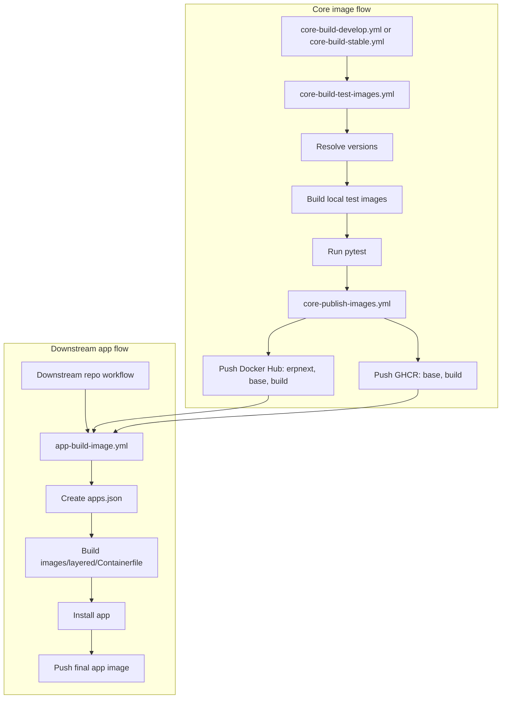

This document describes the current workflow setup for shared core images and reusable downstream app images.

## TransInfoSH 应用发布补充

本 fork 在 `.github/workflows/app-release-image.yml` 提供统一的应用镜像发布流程。应用仓库只需保留一个精简调用工作流，并在推送现有的 `v*` 标签或手动选择现有标签时调用它。

与通用的 `app-build-image.yml` 相比，发布流程额外提供：

- 校验 Git 标签与应用 `__version__` 一致，不在发布时反向修改源码或自动创建标签；
- 使用 `images/layered/Release.Containerfile` 和 GitHub Actions 构建缓存；
- 用提交 SHA 锁定附加应用，即使附加应用仍使用长期分支，也能阻止分支移动后的非确定性重建；
- 以 Git Tag 和提交 SHA 双重锁定前端共享包，并在构建业务应用资源前检出到 Bench 的 `packages/` 目录；
- 先构建单平台测试镜像，检查应用目录、`bench version`，并可创建 PostgreSQL 临时站点执行安装和迁移；
- 发布版本号、源码 SHA 和稳定版 `latest` 三类标签，并写入 OCI 源码、版本和提交标签；
- 保留运行所需的 `node_modules`，仅清理 Python 字节码和 Git 元数据，确保 Frappe 的代码编辑器等按需加载资源可用；
- 通过 BuildKit secret 传递私有源码令牌，令牌不会写入 `apps.json` 或最终镜像。

## 发布版本命名约束

后续所有 TransInfoSH 应用与基础镜像发布必须遵循以下规则：

| 对象          | Git Tag  | Docker 镜像 Tag                                   |
| ------------- | -------- | ------------------------------------------------- |
| 业务应用      | `vX.Y.Z` | `X.Y.Z`                                           |
| `frappe_ext`  | `vX.Y.Z` | 不单独发布运行镜像；基础镜像 Tag 使用 `ext-X.Y.Z` |
| `tsuite-base` | 不适用   | `version-<Frappe 精确版本>-ext-<frappe_ext 版本>` |

例如，Frappe 为 `16.31.0`、`frappe_ext` 为 `v0.1.0` 时，基础镜像必须为：

```text
ghcr.io/transinfosh/tsuite-base:version-16.31.0-ext-0.1.0
```

不要将 Git Tag 的前缀 `v` 带入 Docker 镜像 Tag；Frappe 的 `version-16` 分支名也不能代替精确的 Frappe 版本号。基础镜像构建配置必须锁定 `frappe_ext` 的 Git Tag 和对应 40 位提交 SHA；应用镜像必须固定引用已发布的 `tsuite-base` 版本。

提供 `APP_SOURCE_TOKEN` 时，构建器会为 `apps.json` 中应用所属的 GitHub
组织配置临时认证。因此，应用的包管理器可以从同一组织下的其他私有仓库安装锁定
到 Tag 或提交的 Git 依赖。认证配置只存在于构建步骤中，并会在复制到运行镜像前删除。

调用方应使用完整提交 SHA 固定 `transinfosh/frappe_docker` 的工作流版本，并将同一个 SHA 传给 `builder_ref`。附加应用使用如下格式：

```yaml
extra_apps_json: >-
  [{"url":"https://github.com/transinfosh/base.git",
    "branch":"develop",
    "commit":"完整的 40 位提交 SHA"}]
```

当附加应用分支发生变化时，旧版本重跑会停止，而不是静默构建不同内容。发布新版本前，应审查依赖变更并更新调用工作流中的锁定提交。

组合镜像使用本地 `file:` 共享包时，也必须使用相同的锁定格式，并通过 `extra_packages_json`
声明。包会按仓库名检出到 `packages/`，例如：

```yaml
extra_packages_json: >-
  [{"url":"https://github.com/transinfosh/transinfo-ui.git",
    "branch":"v0.1.4",
    "commit":"完整的 40 位提交 SHA"}]
build_apps: tbi tai
```

`build_apps` 应列出所有有前端资产的组合应用；为空时只构建主应用。

## 框架基础镜像

`Framework Base Image` 工作流会生成不可变的框架镜像，其中包含 Frappe、`frappe_ext` 和已经构建的框架资源。应用发布工作流以该镜像为父层，只获取、安装和构建业务应用；因此业务代码变更不会使 Frappe 与 `frappe_ext` 的大层失效。

基础镜像使用 `version-<Frappe 精确版本>-ext-<frappe_ext 版本>` 作为发布版本，例如 `ghcr.io/transinfosh/tsuite-base:version-16.31.0-ext-0.1.0`。构建基础镜像时传入的 `framework_apps_json` 与附加应用采用相同的 `url`、`branch` 和 40 位 `commit` 格式：`branch` 可以是 Git Tag 或分支，但框架扩展必须使用发布 Tag。构建会同时校验该 Tag（优先）或分支仍指向所锁定的提交。只有 Frappe 精确版本、框架扩展的发布 Tag 或锁定提交变更时，才需要发布新的 `tsuite-base` 版本，并在调用方更新 `framework_image`。

# Workflow roles

The current workflow layout is:

- `.github/workflows/core-build-develop.yml`
- `.github/workflows/core-build-stable.yml`
- `.github/workflows/core-build-test-images.yml`
- `.github/workflows/core-publish-images.yml`
- `.github/workflows/app-build-image.yml`

`core-build-develop.yml` and `core-build-stable.yml` are orchestration workflows.
They decide when the core image pipeline runs.

`core-build-test-images.yml` is the reusable workflow that:

- resolves the image versions for the requested release line
- builds the shared core images into a local registry
- runs the test suite against those images

`core-publish-images.yml` is the reusable workflow that:

- publishes the tested images to Docker Hub
- publishes `base` and `build` to GHCR

`app-build-image.yml` is the reusable workflow that downstream repositories call to:

- create an `apps.json` file from the caller's app repository and ref
- build `images/layered/Containerfile`
- consume existing `base` and `build` images
- install the requested app into the final image
- optionally push the final app image to the caller's registry

# Current flow

The current structure is:

```text
core orchestration
  -> core build and test
  -> core publish

downstream app workflow
  -> consume published base and build
  -> install app
  -> publish final app image
```

Current Mermaid overview:



More concretely:

```text
core-build-test-images.yml
  -> resolves frappe and erpnext tags
  -> builds images into a local CI registry
  -> runs tests

core-publish-images.yml
  -> pushes Docker Hub: erpnext, base, build
  -> pushes GHCR: base, build

app-build-image.yml
  -> pulls:
     - <prefix>/base:<frappe_ref>
     - <prefix>/build:<frappe_ref>
  -> installs app from app_repo + app_ref
  -> pushes final image_name:image_tag
```

# Naming convention

GitHub Actions requires workflow files to stay directly inside `.github/workflows`.
Subdirectories are not supported for workflow files, so structure should come from file names and `name:` values.

Recommended file naming convention:

```text
<area>-<action>-<subject>.yml
```

Current examples:

- `core-build-bench.yml`
- `core-build-develop.yml`
- `core-build-stable.yml`
- `core-build-test-images.yml`
- `core-publish-images.yml`
- `app-build-image.yml`
- `docs-publish-site.yml`

Recommended visible workflow names:

- `Core / Build Bench`
- `Core / Build Develop`
- `Core / Build Stable`
- `Core / Build and Test Images`
- `Core / Publish Images`
- `App / Build Image`
- `Docs / Publish Site`

# Style rules

To keep workflows predictable, use one convention per category instead of mixing styles.

Workflow file names should use kebab-case:

```text
core-build-test-images.yml
app-build-image.yml
```

Workflow display names should use short title-style groups:

```text
Core / Build and Test Images
App / Build Image
```

Workflow inputs should use snake_case:

```yaml
app_name:
frappe_ref:
image_name:
```

Environment variables should use upper snake case:

```text
FRAPPE_IMAGE_PREFIX
PYTHON_VERSION
NODE_VERSION
```

The recommended rule set is:

- workflow file names: kebab-case
- workflow `name:` values: grouped title case
- workflow inputs: snake_case
- job ids and step ids: snake_case where practical
- environment variables: UPPER_SNAKE_CASE

This means `-` is preferred for file names, while `_` remains appropriate for YAML keys, inputs, and environment variables.

# Important inputs in `app-build-image.yml`

The reusable app workflow is controlled mainly by these inputs:

- `app_name`
  The application directory name, for example `crm`
- `app_repo`
  The Git repository to install, for example `frappe/crm`
- `app_ref`
  The branch or tag to install, for example `develop`
- `frappe_ref`
  The tag of the existing `base` and `build` images, for example `version-16`
- `frappe_image_prefix`
  Where the shared `base` and `build` images come from, for example `frappe` or `ghcr.io/frappe`
- `image_name`
  The final target image name, for example `ghcr.io/acme/crm`
- `image_tag`
  The final target image tag, for example `develop`
- `registry`
  The registry for the final push, for example `ghcr.io` or `docker.io`

The key distinction is:

```text
frappe_image_prefix = source of shared base/build images
image_name          = destination of the final app image
```

# Example: caller repository publishes to GHCR

This example assumes:

- shared base images exist in `ghcr.io/frappe/base` and `ghcr.io/frappe/build`
- the caller repository wants to publish its own app image to `ghcr.io/acme/crm`

```yaml
name: App / Build CRM Image

on:
  workflow_dispatch:
  push:
    branches:
      - develop

permissions:
  contents: read
  packages: write

jobs:
  build-image:
    uses: frappe/frappe_docker/.github/workflows/app-build-image.yml@main
    with:
      app_name: crm
      app_repo: acme/crm
      app_ref: develop
      frappe_ref: version-16
      frappe_image_prefix: ghcr.io/frappe
      image_name: ghcr.io/acme/crm
      image_tag: develop
      registry: ghcr.io
      push: true
      platforms: linux/amd64
```

What happens:

```text
1. app-build-image.yml is called
2. apps.json is generated from acme/crm + develop
3. the workflow builds images/layered/Containerfile
4. layered uses:
   - ghcr.io/frappe/build:version-16
   - ghcr.io/frappe/base:version-16
5. CRM is installed
6. the final image is pushed to ghcr.io/acme/crm:develop
```

For GHCR, the caller workflow should grant:

- `permissions: packages: write`

The reusable workflow then logs in with the workflow token.

# Example: caller repository publishes to Docker Hub

This example assumes:

- shared base images come from Docker Hub under `frappe`
- the caller repository wants to publish its app image to Docker Hub as `acme/crm`

```yaml
name: App / Build CRM Image

on:
  workflow_dispatch:
  push:
    branches:
      - develop

jobs:
  build-image:
    uses: frappe/frappe_docker/.github/workflows/app-build-image.yml@main
    with:
      app_name: crm
      app_repo: acme/crm
      app_ref: develop
      frappe_ref: version-16
      frappe_image_prefix: frappe
      image_name: acme/crm
      image_tag: develop
      registry: docker.io
      push: true
      platforms: linux/amd64
    secrets:
      REGISTRY_USERNAME: ${{ secrets.DOCKERHUB_USERNAME }}
      REGISTRY_PASSWORD: ${{ secrets.DOCKERHUB_TOKEN }}
```

In this case:

- shared images are pulled from `frappe/base:version-16` and `frappe/build:version-16`
- the final image is pushed to Docker Hub as `acme/crm:develop`
